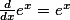

---
output:
  html_document:
    keep_md: yes
---

Using textormd to create typeset math with Rmd and a Github wiki
========================================================

**Note: This approach has not been widely tested!**

This markdown document was created from an R Markdown (Rmd) document compiled to HTML through `knitr` with the `keep_md: yes` set in the preamble of the Rmd document.  

The following is an extension of the familiar sample R Markdown document. The example below shows how we can source the `textormd()` function available [here](https://github.com/mienkoja/textormd).


```r
source("~/repos/textormd/textormd.R")
```


Having sourced this function, we can then call our desired latex math code inline `textormd("\\textstyle \\frac{d}{dx}e^x=e^x")` (See this [link](https://support.rstudio.com/hc/en-us/articles/200552086-Using-R-Markdown?version=0.98.490&mode=desktop) for more information about inline R code in R Markdown documents).

When the R Markdown document is compiled to HTML (in `knitr` with `keep_md: yes` in the preamble) the inline code will result in the following typeset math text:  along with your R code and R graphics as shown below. 

Some sample R code...


```r
summary(cars)
```

```
##      speed           dist    
##  Min.   : 4.0   Min.   :  2  
##  1st Qu.:12.0   1st Qu.: 26  
##  Median :15.0   Median : 36  
##  Mean   :15.4   Mean   : 43  
##  3rd Qu.:19.0   3rd Qu.: 56  
##  Max.   :25.0   Max.   :120
```


A sample R plot...


```r
plot(cars)
```

 


When this process is performed in a local Github wiki repo (see the link [here](https://help.github.com/articles/adding-and-editing-wiki-pages-locally/)), the resulting markdown document can be pushed to the live repository (along with your math png files and any other figures). The markdown documents will then appear in your repo as wiki pages along with the typeset math font and any other images you push to the wiki repo.  

More details on the how to specify your tex can be found in the `mathtex` documentation [here](http://www.forkosh.com/mathtex.html).

